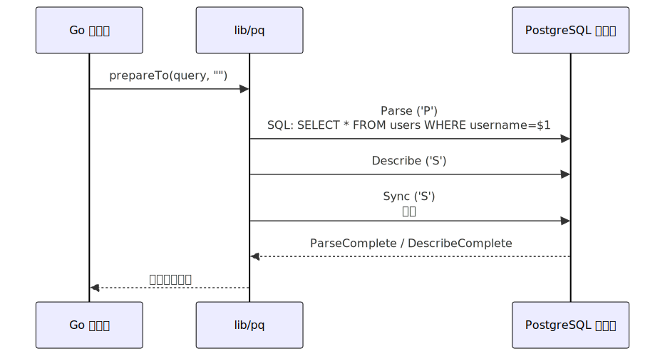
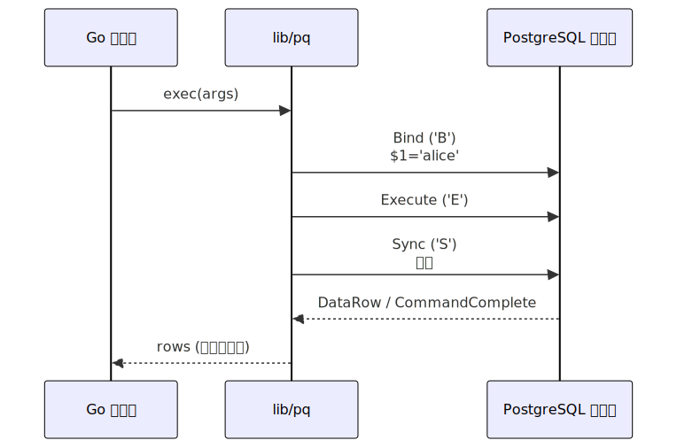

# なぜプレースホルダでSQLi対策ができるか

<!-- <style scoped>
  .profile-icon {
    width: 90px;
    float: left;
    margin-right: 16px;
  }
</style>

 -->

### RiiiM(りむ)

<br />

2025-08-30 

<!-- <https://slides.su8.run/250711-huit> -->

---

<!--
header: 自己紹介
-->

<style scoped>
  .profile-icon {
    width: 400px;
    float: right;
    margin-right: -20px;
    margin-top: -20px;
  }
  .profile-icon2 {
    width: 130px;
    position: absolute;
    right: 70px;
    top: 330px;
    border: 10px solid white;
    border-radius: 100%;
  }
</style>


# 自己紹介

## RiiiM(リム)

- セキュリティエンジニアになりたい
  株式会社スリーシェイク
<!-- - **HUIT 部長** / 3DP 研 / JagaJaga (Hupass) -->
- Twitter: [@riiim400th](https://x.com/riiim400th) , GitHub: [@riiim400th](https://github.com/riiim400th)
- すきなもの：コードリーディング/ 朝5時ラウンドワン
- 脆弱性診断をやっておりました
- ひとこと：低レイヤー興味あるけど沼りそう

---
<!--
header: SQLインジェクションについて
-->

# SQLインジェクションについて

---
## 概要

- ユーザー入力を **直接 SQL 文に埋め込む** ことで発生する脆弱性
- 攻撃者が意図しない SQL を実行可能
- データベースの情報漏洩や破壊につながる
---

## 例（危険なコード）
```go
// 危険: 文字列連結
query := "SELECT * FROM users WHERE username = '" + username + "';"
db.Query(query)
```

ユーザー入力: `' OR '1'='1`
→ 全件取得される可能性

---

## 操作されたSQL
```
username = `' OR '1'='1`
SELECT * FROM users WHERE username = '" + username + "';
```
↓
```
SELECT * FROM users WHERE username = '' OR '1'='1';
```
OR句が追加され以降も等式が不正挿入されている

**値のフィールドからSQLシンタックスを不正追加される** 脆弱性と言える

---

## 対策は？
プレースホルダを使用しましょう / プリペアードステートメントを使用しましょう(本日の話)
```go
//goのコード例　(database/sql)

db, err := sql.Open("postgres", dbURL)
userID := 1
query := "SELECT * FROM users WHERE id = $1"
row := db.QueryRow(query, userID)
```

**なぜこれで安全になるのか？**
プレースホルダを使用していても、SQLを組み立てるときにユーザーinputを処理しなければならないが
どのような実装が安全なことを保証しているのか？

---

<!--
header: ライブラリを見てみる
-->


## ライブラリを見てみる

---

### はじめに

go言語のライブラリを見ていきます
今回はPostgre SQL

---


```go
//main.go
import (
	"database/sql"

	_ "github.com/lib/pq" //postgresのドライバー
)


func main() {

	dbURL := os.Getenv("DATABASE_URL")

	db, err := sql.Open("postgres", dbURL)
	defer db.Close()

  name := "alice"
	query := "SELECT * FROM users WHERE name = $1"
	row := db.QueryRow(query, name) //break point
...
```
---

database/sqlとドライバー(lib/pq)の関係



database/sqlはドライバー非依存のインターフェース
実際にプロトコル通信を担当するのはドライバー

---

```go
//main.go
row := db.QueryRow(query, userID) //into
```
↓
```go
func (db *DB) QueryRow(query string, args ...any) *Row {
	return db.QueryRowContext(context.Background(), query, args...)
  // into
}
```
↓
```go
func (db *DB) QueryRowContext(ctx context.Context, query string, args ...any) *Row {
	rows, err := db.QueryContext(ctx, query, args...) // into
	return &Row{rows: rows, err: err}
}
```
↓
...

---

```go
func ctxDriverQuery(
	ctx context.Context, 
	queryerCtx driver.QueryerContext, 
	queryer driver.Queryer, 
	query string, nvdargs []driver.NamedValue) (driver.Rows, error) {

	if queryerCtx != nil {
		return queryerCtx.QueryContext(ctx, query, nvdargs) // into
	}
//...
```
↓ここからドライバー
```go
func (cn *conn) QueryContext(
  ctx context.Context, query string, args []driver.NamedValue) (driver.Rows, error) {

	finish := cn.watchCancel(ctx)
	r, err := cn.query(query, list) //おっ
}
```
---

PostgreSQLサーバーに送信直前の関数に辿りついた
```go
// github.com/lib/pq@v1.10.9/conn.go

func (cn *conn) query(query string, args []driver.Value) (_ *rows, err error) {
	if err := cn.err.get(); err != nil {
		return nil, err
	}
	if cn.inCopy {
		return nil, errCopyInProgress
	}
	defer cn.errRecover(&err)

	// Check to see if we can use the "simpleQuery" interface, which is
	// *much* faster than going through prepare/exec
	if len(args) == 0 {
		return cn.simpleQuery(query)
	}

	if cn.binaryParameters {
		cn.sendBinaryModeQuery(query, args)

		cn.readParseResponse()
		cn.readBindResponse()
		rows := &rows{cn: cn}
		rows.rowsHeader = cn.readPortalDescribeResponse()
		cn.postExecuteWorkaround()
		return rows, nil
	}
	st := cn.prepareTo(query, "")
	st.exec(args)
	return &rows{
		cn:         cn,
		rowsHeader: st.rowsHeader,
	}, nil
}
```
---
たどり着いたのがこれ(抜粋)
1. prepareToにクエリを渡している
2. st.exec() で実際の値を処理して実行してそう

```go
// github.com/lib/pq@v1.10.9/conn.go

func (cn *conn) query(query string, args []driver.Value) (_ *rows, err error) {
	// ...
	st := cn.prepareTo(query, "") // 1.
	st.exec(args) // 2.
	return &rows{
		cn:         cn,
		rowsHeader: st.rowsHeader,
	}, nil
}
...
```

---
### prepareTo
- `P` というバイト値を書き込み
- クエリを書き込み、サーバーに送信
```go
func (cn *conn) prepareTo(q, stmtName string) *stmt {
	st := &stmt{cn: cn, name: stmtName}

	b := cn.writeBuf('P')
	b.string(st.name)
	b.string(q)
	b.int16(0)
  //...
	cn.send(b)
  //...
	return st
}
```

---
### exec
- `B` というバイト値を書き込み
- 引数 v (今回だとuserid)を受け取り
```go
func (st *stmt) exec(v []driver.Value) {
//...
	cn := st.cn
	w := cn.writeBuf('B')
	w.byte(0) // unnamed portal
//...
	w.next('E')
//...
	w.next('S')
	cn.send(w)
//...
}
```

---
P,B,Eはなんなのか

これはクライアントがDBサーバーにバイト送信するときの "メッセージタイプ" というもの
**拡張クエリプロトコル** で定義されている

---

### 拡張クエリプロトコル
https://www.postgresql.org/docs/current/protocol-flow.html?utm_source=chatgpt.com#PROTOCOL-FLOW-EXT-QUERY

> 拡張クエリプロトコルは、上記のシンプルなクエリプロトコルを複数のステップに分解します。Prepareステップの結果を複数回再利用することで、効率性が向上します。さらに、データ値をクエリ文字列に直接挿入するのではなく、個別のパラメータとして指定できるなどの追加機能も利用できます。

まんまプリペアードステートメントの話

---

|    Message   | byte   | 説明                                                      |
| ------------- | ----- | ------------------------------------------------------- |
| **Parse**     | `'P'` | SQL 文を解析し、Prepared Statement を作成。ステートメント名・SQL・パラメータ型を送る |
| **Bind**      | `'B'` | Prepared Statement に引数を埋め込み Portal を作る。バイナリ/テキスト形式の値を送信 |
| **Execute**   | `'E'` | Portal を実行し、結果を取得                                       |
| **Sync**      | `'S'` | ここまでのリクエストの完了をサーバに通知。ReadyForQuery を返すきっかけになる           |

先ほどのコードを追うとバッファへの書き込みはこういう流れ
prepareTo()で `P` > `S` > (サーバーに送信)
exec()で `B` > `E` > `S` > (サーバーに送信)


---

つまりmain.goからのQueryはこうなってた

```go
// main.go
	name := "alice"
	query := "SELECT id, username, email  FROM users WHERE username = $1"
	row := db.QueryRow(query, name)
```

↓

```go
// <module_path/>github.com/lib/pq@v1.10.9/conn.go
func (cn *conn) query(query string, args []driver.Value) (_ *rows, err error) {

	st := cn.prepareTo(query, "")
	st.exec(args)
```

---

```go
	st := cn.prepareTo(query, "")
	st.exec(args)
```

**prepareTo(query,"")**
> `P` > `S` > (サーバーに送信)

`SELECT id, username, email  FROM users WHERE username = $1`をサーバーに送信

**exec(args)**
> `B` > `E` > `S` > (サーバーに送信)

`$1 = 'alice' (name)` を送信

**これがプリペアードステートメントの実装の正体**

---

### exec　補足
値がバインドされているところを省略していたので
- 値をメッセージ本文に挿入
- prepareToに渡されたクエリ文字列に対する操作がない
```go
func (st *stmt) exec(v []driver.Value) {
  //...
	w := cn.writeBuf('B')
	if cn.binaryParameters {
		cn.sendBinaryParameters(w, v)
	} else {
		w.int16(0)
		w.int16(len(v))
		for i, x := range v {
			if x == nil {
				w.int32(-1)
			} else { //メッセージに値をエンコードして挿入
				b := encode(&cn.parameterStatus, x, st.paramTyps[i])
				w.int32(len(b))
				w.bytes(b)
			}
		}
	} }
```

---



---



---

### 何が言えるか

**prepareTo(query,"")** と **exec(args)** という関数で
**構文** と **値** を別でサーバーに送信している

拡張クエリプロトコルのフローから見ても
構文解析を指示する `Parse` と解析された構文への値のバインド指示 `Bind` が分かれているため、
SQLインジェクションの攻撃方法である **値のフィールドからSQLシンタックスを不正追加する** ということがプロトコル上でもできないようになっている。

---

### ライブラリのプレースホルダでSQLインジェクションはできなかった!

拡張クエリプロトコルを使用して
`Parse` ->> `Bind` の流れで処理を行っているライブラリは同様に対策ができているといえる


---

### 拡張でないクエリプロトコルについては？

こちらはプレースホルダがない時のプロトコル
```go
func (cn *conn) query(query string, args []driver.Value) (_ *rows, err error) {
  //...
	// Check to see if we can use the "simpleQuery" interface, which is
	// *much* faster than going through prepare/exec
	if len(args) == 0 {
		return cn.simpleQuery(query)
	}

```
引数がなければ(プレースホルダになっていない場合)

---

```go

func (cn *conn) simpleQuery(q string) (res *rows, err error) {
	defer cn.errRecover(&err)

	b := cn.writeBuf('Q')
	b.string(q)
	cn.send(b)
//...
```


|    Message   | byte   | 説明                                                      |
| ------------- | ----- | ------------------------------------------------------- |
| **Query**     | `'Q'` | 実行したい SQL 文をそのまま送信 |


---

### PostgreSQL以外では？

| DB         | プリペアードステートメント | プロトコル名・仕組み                                                    |
| ---------- | ------------- | ------------------------------------------------------------- |
| PostgreSQL | ○             | Extended Query Protocol (`Parse` → `Bind` → `Execute`)        |
| MySQL      | ○             | Prepared Statements Protocol (`COM_STMT_PREPARE` → `EXECUTE`) |
| SQLite3    | ○             | C_API レベルでプリペアードステートメント（組み込み型）                                  |

---

### 参考

- [lib/pq](https://github.com/lib/pq)

- [PosgreSQL拡張クエリプロトコル](https://www.postgresql.org/docs/current/protocol-flow.html#PROTOCOL-FLOW-SIMPLE-QUERY)

- []

---

# おわり

